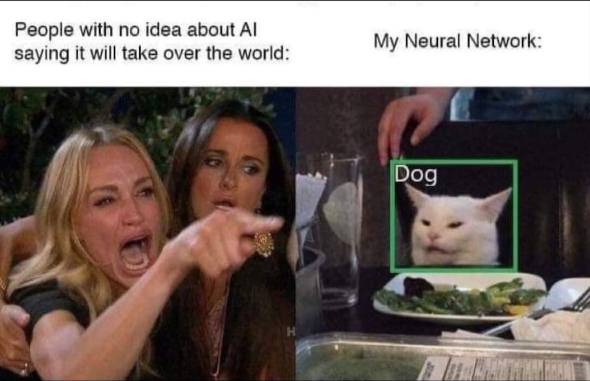

# Cat versus Dog

# Introduction
This is an attempt at building a convolutional neural network for image classification of cats and dogs. The dataset can be downloaded [here](https://www.kaggle.com/c/dogs-vs-cats).
# Material
The packages and software used is the following:

1. Google Colab
2. Numpy
3. Matplotlib
4. PyTorch

# Method
